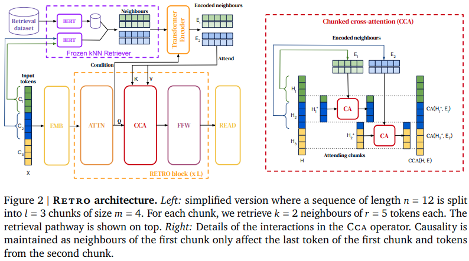

</img>

## RETRO - Pytorch

Implementation of <a href="https://arxiv.org/abs/2112.04426">RETRO</a>, Deepmind's Retrieval based Attention net, in Pytorch. This will deviate from the paper slightly, using rotary embeddings for relative positional encoding, as well as Faiss library instead of Scann.

This library leverages <a href="https://github.com/criteo/autofaiss">autofaiss</a> for building the index and calculating the k-nearest neighbors for all chunks.

<a href="http://jalammar.github.io/illustrated-retrieval-transformer/">Jay Alammar explanatory blogpost</a>

The selling point of this retriever approach is reaching GPT-3 performance at 10x less parameters. More research is <a href="https://arxiv.org/abs/2009.06857">definitely deserved</a> in this area.

I have also included the features necessary to scale the retrieval transformer to 1000 layers, if the claims of <a href="https://arxiv.org/abs/2203.00555">DeepNet paper</a> is to be believed.

Update: Someone on Reddit has gifted me a <a href="https://old.reddit.com/r/MachineLearning/comments/s4f1p8/d_is_there_an_opensource_implementation_of_the/hstia5r/">Gold Award</a>. Not sure what it is, but thank you! 🙏

## Install

```bash
$ pip install retro-pytorch
````

## Usage

```python
import torch
from retro_pytorch import RETRO

retro = RETRO(
    chunk_size = 64,                         # the chunk size that is indexed and retrieved (needed for proper relative positions as well as causal chunked cross attention)
    max_seq_len = 2048,                      # max sequence length
    enc_dim = 896,                           # encoder model dim
    enc_depth = 2,                           # encoder depth
    dec_dim = 796,                           # decoder model dim
    dec_depth = 12,                          # decoder depth
    dec_cross_attn_layers = (3, 6, 9, 12),   # decoder cross attention layers (with causal chunk cross attention)
    heads = 8,                               # attention heads
    dim_head = 64,                           # dimension per head
    dec_attn_dropout = 0.25,                 # decoder attention dropout
    dec_ff_dropout = 0.25,                   # decoder feedforward dropout
    use_deepnet = True                       # turn on post-normalization with DeepNet residual scaling and initialization, for scaling to 1000 layers
)

seq = torch.randint(0, 20000, (2, 2048 + 1))      # plus one since it is split into input and labels for training
retrieved = torch.randint(0, 20000, (2, 32, 2, 128)) # retrieved tokens - (batch, num chunks, num retrieved neighbors, retrieved chunk with continuation)

loss = retro(seq, retrieved, return_loss = True)
loss.backward()

# do above for many steps
```


## RETRO Training Wrapper

The aim of the `TrainingWrapper` is to process a folder of text documents into the necessary memmapped numpy arrays to begin training `RETRO`.

```python
import torch
from retro_pytorch import RETRO, TrainingWrapper

# instantiate RETRO, fit it into the TrainingWrapper with correct settings

retro = RETRO(
    max_seq_len = 2048,                      # max sequence length
    enc_dim = 896,                           # encoder model dimension
    enc_depth = 3,                           # encoder depth
    dec_dim = 768,                           # decoder model dimensions
    dec_depth = 12,                          # decoder depth
    dec_cross_attn_layers = (1, 3, 6, 9),    # decoder cross attention layers (with causal chunk cross attention)
    heads = 8,                               # attention heads
    dim_head = 64,                           # dimension per head
    dec_attn_dropout = 0.25,                 # decoder attention dropout
    dec_ff_dropout = 0.25                    # decoder feedforward dropout
).cuda()

wrapper = TrainingWrapper(
    retro = retro,                                 # path to retro instance
    knn = 2,                                       # knn (2 in paper was sufficient)
    chunk_size = 64,                               # chunk size (64 in paper)
    documents_path = './text_folder',              # path to folder of text
    glob = '**/*.txt',                             # text glob
    chunks_memmap_path = './train.chunks.dat',     # path to chunks
    seqs_memmap_path = './train.seq.dat',          # path to sequence data
    doc_ids_memmap_path = './train.doc_ids.dat',   # path to document ids per chunk (used for filtering neighbors belonging to same document)
    max_chunks = 1_000_000,                        # maximum cap to chunks
    max_seqs = 100_000,                            # maximum seqs
    knn_extra_neighbors = 100,                     # num extra neighbors to fetch
    max_index_memory_usage = '100m',
    current_memory_available = '1G'
)

# get the dataloader and optimizer (AdamW with all the correct settings)

train_dl = iter(wrapper.get_dataloader(batch_size = 2, shuffle = True))
optim = wrapper.get_optimizer(lr = 3e-4, wd = 0.01)

# now do your training
# ex. one gradient step

seq, retrieved = map(lambda t: t.cuda(), next(train_dl))

# seq       - (2, 2049)         - 1 extra token since split by seq[:, :-1], seq[:, 1:]
# retrieved - (2, 32, 2, 128)   - 128 since chunk + continuation, each 64 tokens

loss = retro(
    seq,
    retrieved,
    return_loss = True
)

# one gradient step

loss.backward()
optim.step()
optim.zero_grad()

# do above for many steps, then ...

# topk sampling with retrieval at chunk boundaries

sampled = wrapper.generate(filter_thres = 0.9, temperature = 1.0) # (1, <2049) terminates early if all <eos>

# or you can generate with a prompt, knn retrieval for initial chunks all taken care of

prompt = torch.randint(0, 1000, (1, 128))  # start with two chunks worth of sequence
sampled = wrapper.generate(prompt, filter_thres = 0.9, temperature = 1.0) # (1, <2049) terminates early if all <eos>

```

If you wish to force a reprocess of the training data, simply run your script with a `REPROCESS=1` environment flag as so

```bash
$ REPROCESS=1 python train.py
```

## RETRO Datasets

The `RETRODataset` class accepts paths to a number of memmapped numpy arrays containing the chunks, the index of the first chunk in the sequence to be trained on (in RETRO decoder), and the pre-calculated indices of the k-nearest neighbors per chunk.

You can use this to easily assemble the data for `RETRO` training, if you do not wish to use the `TrainingWrapper` from above.

Furthermore, all the functions needed to create the necessary memmapped data is in the sections to follow.


```python
import torch
from torch.utils.data import DataLoader
from retro_pytorch import RETRO, RETRODataset

# mock data constants

import numpy as np

NUM_CHUNKS = 1000
CHUNK_SIZE = 64
NUM_SEQS = 100
NUM_NEIGHBORS = 2

def save_memmap(path, tensor):
    f = np.memmap(path, dtype = tensor.dtype, mode = 'w+', shape = tensor.shape)
    f[:] = tensor
    del f

# generate mock chunk data

save_memmap(
    './train.chunks.dat',
    np.int32(np.random.randint(0, 8192, size = (NUM_CHUNKS, CHUNK_SIZE + 1)))
)

# generate nearest neighbors for each chunk

save_memmap(
    './train.chunks.knn.dat',
    np.int32(np.random.randint(0, 1000, size = (NUM_CHUNKS, NUM_NEIGHBORS)))
)

# generate seq data

save_memmap(
    './train.seq.dat',
    np.int32(np.random.randint(0, 128, size = (NUM_SEQS,)))
)

# instantiate dataset class
# which constructs the sequence and neighbors from memmapped chunk and neighbor information

train_ds = RETRODataset(
    num_sequences = NUM_SEQS,
    num_chunks = NUM_CHUNKS,
    num_neighbors = NUM_NEIGHBORS,
    chunk_size = CHUNK_SIZE,
    seq_len = 2048,
    chunk_memmap_path = './train.chunks.dat',
    chunk_nn_memmap_path = './train.chunks.knn.dat',
    seq_memmap_path = './train.seq.dat'
)

train_dl = iter(DataLoader(train_ds, batch_size = 2))

# one forwards and backwards

retro = RETRO(
    max_seq_len = 2048,                      # max sequence length
    enc_dim = 896,                           # encoder model dimension
    enc_depth = 3,                           # encoder depth
    dec_dim = 768,                           # decoder model dimensions
    dec_depth = 12,                          # decoder depth
    dec_cross_attn_layers = (1, 3, 6, 9),    # decoder cross attention layers (with causal chunk cross attention)
    heads = 8,                               # attention heads
    dim_head = 64,                           # dimension per head
    dec_attn_dropout = 0.25,                 # decoder attention dropout
    dec_ff_dropout = 0.25                    # decoder feedforward dropout
).cuda()

seq, retrieved = map(lambda t: t.cuda(), next(train_dl))

# seq       - (2, 2049)         - 1 extra token since split by seq[:, :-1], seq[:, 1:]
# retrieved - (2, 32, 2, 128)   - 128 since chunk + continuation, each 64 tokens

loss = retro(
    seq,
    retrieved,
    return_loss = True
)

loss.backward()

```

## Retrieval related tools

This repository will use the default tokenizer (sentencepiece) for the cased version of BERT. Embeddings will be fetched from the vanilla BERT, and can either be masked mean pooled representation, or the CLS token.

ex. masked mean pooled representation

```python
from retro_pytorch.retrieval import bert_embed, tokenize

ids = tokenize([
    'hello world',
    'foo bar'
])

embeds = bert_embed(ids) # (2, 768) - 768 is hidden dimension of BERT
```

ex. CLS token representation


```python
from retro_pytorch.retrieval import bert_embed, tokenize

ids = tokenize([
    'hello world',
    'foo bar'
])

embeds = bert_embed(ids, return_cls_repr = True) # (2, 768)
```

Create your chunks and chunk start indices (for calculating sequence ranges for autoregressive training) using `text_folder_to_chunks_`

```python
from retro_pytorch.retrieval import text_folder_to_chunks_

stats = text_folder_to_chunks_(
    folder = './text_folder',
    glob = '**/*.txt',
    chunks_memmap_path = './train.chunks.dat',
    seqs_memmap_path = './train.seq.dat',
    doc_ids_memmap_path = './train.doc_ids.dat',  # document ids are needed for filtering out neighbors belonging to same document appropriately during computation of nearest neighbors
    chunk_size = 64,
    seq_len = 2048,
    max_chunks = 1_000_000,
    max_seqs = 100_000
)

# {'chunks': <number of chunks>, 'docs': <number of documents>, 'seqs': <number of sequences>}
```

## Fetching Nearest Neighbors

You can turn your memmapped chunks numpy array into embeddings and a faiss index with one command

```python
from retro_pytorch.retrieval import chunks_to_index_and_embed

index, embeddings = chunks_to_index_and_embed(
    num_chunks = 1000,
    chunk_size = 64,
    chunk_memmap_path = './train.chunks.dat'
)

query_vector = embeddings[:1]                   # use first embedding as query
_, indices = index.search(query_vector, k = 2)  # fetch 2 neighbors, first indices should be self

neighbor_embeddings = embeddings[indices]       # (1, 2, 768)

```

You can also directly calculate the nearest neighbor file necessary for training, with `chunks_to_precalculated_knn_` command

```python
from retro_pytorch.retrieval import chunks_to_precalculated_knn_

chunks_to_precalculated_knn_(
    num_chunks = 1000,
    chunk_size = 64,
    chunk_memmap_path = './train.chunks.dat',    # path to main chunks dataset
    doc_ids_memmap_path = './train.doc_ids.dat', # path to document ids created by text_folder_to_chunks_, used for filtering out neighbors that belong to the same document
    num_nearest_neighbors = 2,                   # number of nearest neighbors you'd like to use
    num_extra_neighbors = 10                     # fetch 10 extra neighbors, in the case that fetched neighbors are frequently from same document (filtered out)
)

# nearest neighbor info saved to ./train.chunks.knn.dat

```

## Citations

```bibtex
@misc{borgeaud2022improving,
    title   = {Improving language models by retrieving from trillions of tokens}, 
    author  = {Sebastian Borgeaud and Arthur Mensch and Jordan Hoffmann and Trevor Cai and Eliza Rutherford and Katie Millican and George van den Driessche and Jean-Baptiste Lespiau and Bogdan Damoc and Aidan Clark and Diego de Las Casas and Aurelia Guy and Jacob Menick and Roman Ring and Tom Hennigan and Saffron Huang and Loren Maggiore and Chris Jones and Albin Cassirer and Andy Brock and Michela Paganini and Geoffrey Irving and Oriol Vinyals and Simon Osindero and Karen Simonyan and Jack W. Rae and Erich Elsen and Laurent Sifre},
    year  = {2022},
    eprint = {2112.04426},
    archivePrefix = {arXiv},
    primaryClass = {cs.CL}
}
```

```bibtex
@misc{su2021roformer,
    title   = {RoFormer: Enhanced Transformer with Rotary Position Embedding},
    author  = {Jianlin Su and Yu Lu and Shengfeng Pan and Bo Wen and Yunfeng Liu},
    year    = {2021},
    eprint  = {2104.09864},
    archivePrefix = {arXiv},
    primaryClass = {cs.CL}
}
```

```bibtex
@article{Wang2022DeepNetST,
    title   = {DeepNet: Scaling Transformers to 1, 000 Layers},
    author  = {Hongyu Wang and Shuming Ma and Li Dong and Shaohan Huang and Dongdong Zhang and Furu Wei},
    journal = {ArXiv},
    year    = {2022},
    volume  = {abs/2203.00555}
}
```

```bibtex
@misc{zhang2021sparse,
    title   = {Sparse Attention with Linear Units},
    author  = {Biao Zhang and Ivan Titov and Rico Sennrich},
    year    = {2021},
    eprint  = {2104.07012},
    archivePrefix = {arXiv},
    primaryClass = {cs.CL}
}
```

*I consider always the adult life to be the continuous retrieval of childhood.* - Umberto Eco
